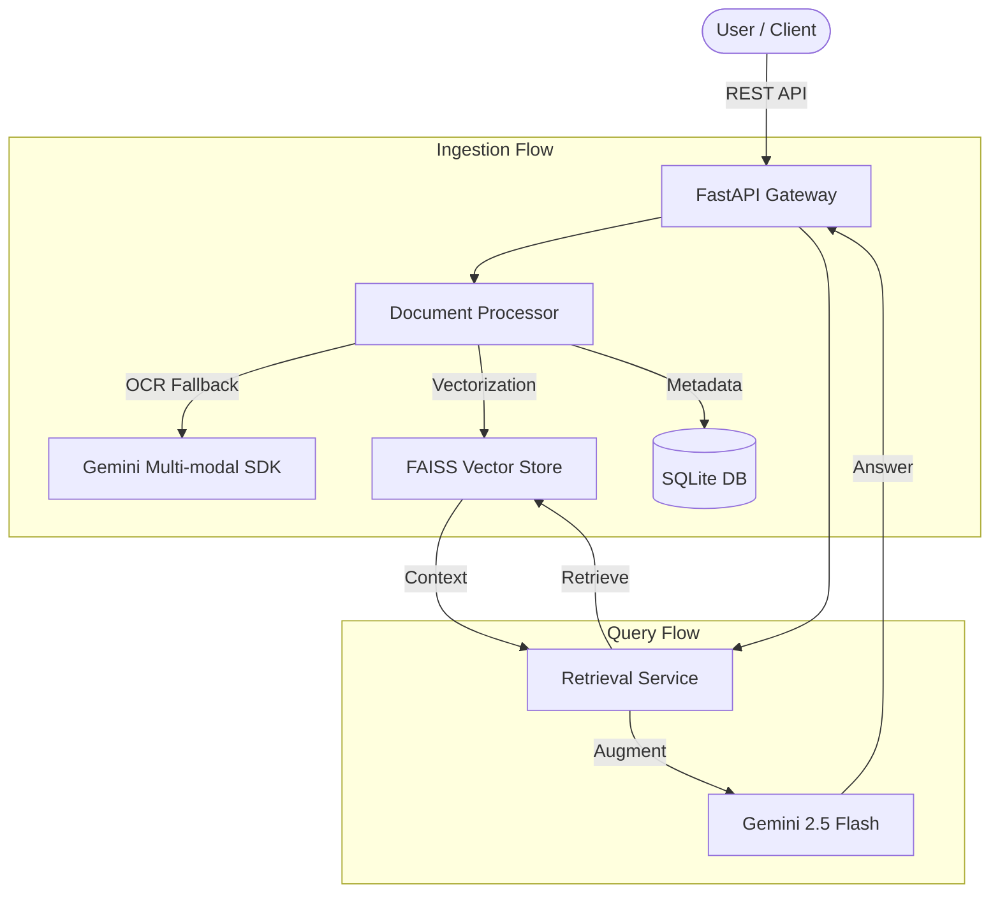

# 🚀 RAG Pipeline: Enterprise-Grade Document Intelligence


[](https://fastapi.tiangolo.com/)
[](https://aistudio.google.com/)
[](https://www.docker.com/)

A production-ready **Retrieval-Augmented Generation (RAG)** pipeline designed for high-performance document interrogation. Powered by **FastAPI**, **Google Gemini**, and **FAISS**.

---

## ✨ Key Features

- **🧠 Multi-Modal Extraction**: Intelligent OCR fallback using Gemini Vision for scanned PDFs and images.
- **⚡ High-Speed Retrieval**: FAISS-powered vector search with L2-normalized cosine similarity.
- **🛡️ Production Ready**: Rate-limiting Nginx proxy, Docker orchestration, and persistent metadata storage.
- **📄 Multi-Format Support**: ingest PDF, DOCX, TXT, MD, JPG, and PNG.
- **🧪 Rigorous Quality**: Full unit and integration test coverage with GitHub Actions CI.

---

## 🏗️ System Architecture

The pipeline is built on a decoupled modular architecture, ensuring scalability and ease of maintenance.



---

## 🚀 Quick Start

### 🐳 Using Docker (Recommended)

1.  **Configure Environment**:
    ```bash
    cp .env.example .env
    # Add your GEMINI_API_KEY to .env
    ```
2.  **Launch Stack**:
    ```bash
    docker compose up --build -d
    ```
3.  **Access Services**:
    - **Backend API**: [http://localhost:8000](http://localhost:8000)
    - **Interactive UI**: [http://localhost:8501](http://localhost:8501)

<details>
<summary><b>🔍 View Advanced Docker Options</b></summary>

- **View Logs**: `docker compose logs -f rag-api`
- **Nginx Proxy Mode**: `docker compose --profile with-nginx up --build -d`
- **Stop Stack**: `docker compose down`

</details>

---

## ⛓️ Technical Stack

| Layer | Technology |
| :--- | :--- |
| **API Framework** | FastAPI 0.115 |
| **LLM Engine** | Google Gemini 2.5 Flash Lite |
| **Embeddings** | Google `gemini-embedding-001` |
| **Vector DB** | FAISS (IndexFlatIP) |
| **Metadata** | SQLite (SQLAlchemy ORM) |
| **UI** | Streamlit |

---

## 🔌 API Reference

### 📂 Document Management
| Method | Endpoint | Description |
| :--- | :--- | :--- |
| `POST` | `/api/v1/documents/upload` | Ingest new document (PDF, DOCX, etc.) |
| `GET` | `/api/v1/documents/` | List all processed documents |
| `GET` | `/api/v1/documents/{id}` | Retrieve document metadata |
| `DELETE` | `/api/v1/documents/{id}` | Purge document from system |

### 💬 Intelligence & Query
| Method | Endpoint | Description |
| :--- | :--- | :--- |
| `POST` | `/api/v1/query/` | Perform a grounded RAG query |
| `GET` | `/api/v1/query/history` | Audit past query-answer pairs |

<details>
<summary><b>💻 Example Usage (curl)</b></summary>

**Upload Document**:
```bash
curl -X POST http://localhost:8000/api/v1/documents/upload -F "file=@demo.pdf"
```

**Execute Query**:
```bash
curl -X POST http://localhost:8000/api/v1/query/ \
     -H "Content-Type: application/json" \
     -d '{"query": "Summarize the key findings", "top_k": 5}'
```

</details>

---

## ⚙️ Configuration

| Variable | Default | Description |
| :--- | :--- | :--- |
| `GEMINI_API_KEY` | `Required` | API Key from Google AI Studio |
| `MAX_DOCUMENTS` | `20` | Max document limit per system |
| `MAX_PAGES_PER_DOC`| `1000` | Hard cap on document size |
| `FAISS_INDEX_PATH` | `./data/faiss` | Persistence directory for vector index |

---

## 🧪 Development & Testing

### Local Setup
1.  **Install dependencies**: `pip install -r requirements.txt`
2.  **OCR Support**: Install `poppler-utils` (`apt-get install poppler-utils` / `brew install poppler`).
3.  **Run Server**: `uvicorn app.main:app --reload`

### Running Tests
```bash
pytest
pytest tests/test_faiss_service.py -v
```

---

## 🌩️ Global Deployment

### Backend (Railway)
1.  Initialize project: `railway init`
2.  Deploy stack: `railway up`
3.  Mount a persistent Volume at `/app/data` to preserve index and documents.

### Frontend (Streamlit Cloud)
1.  Connect GitHub to [Streamlit Cloud](https://share.streamlit.io).
2.  Set `API_BASE_URL` in **Advanced Settings -> Secrets**.
3.  Deploy `ui/Home.py`.

---

## 📜 License
Published under the **MIT License**. Created for the **LLM Intern Assignment**.
