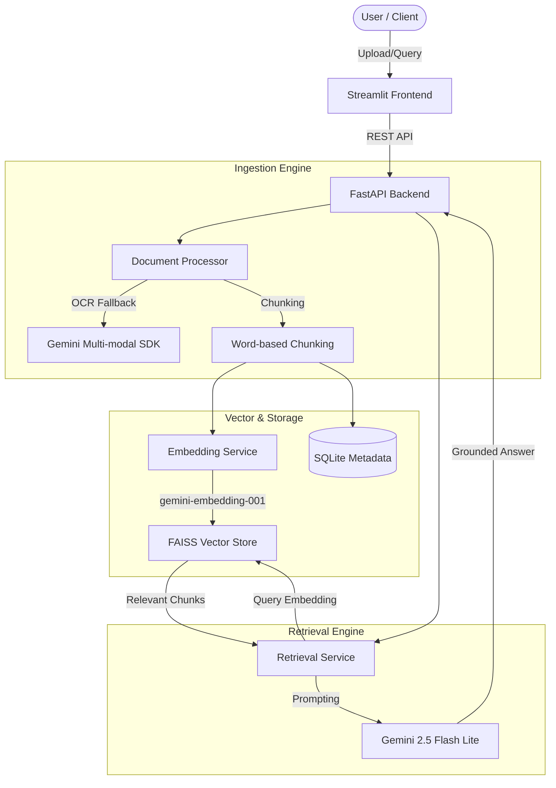

# RAG Pipeline: Professional Interview Walkthrough (AI Engineer)

This document provides a structured narrative for presenting the **RAG Pipeline** project. It is designed to demonstrate deep architectural understanding, engineering maturity, and a "production-first" mindset.

---

## 1. The Assignment & Constraint Alignment

The core objective was to build a robust, containerized RAG system capable of handling high-volume document ingestion and high-precision querying.

| Constraint | Solution Strategy |
| :--- | :--- |
| **20 Docs / 1000 Pages** | Implemented an asynchronous processing pipeline with local PDF/Image OCR fallback to ensure no content is lost due to formatting complexity. |
| **Efficient Retrieval** | Leveraged **FAISS (IndexFlatIP)** with vector normalization to achieve high-performance cosine similarity searches. |
| **Deployment** | Multi-container Docker Compose architecture with Nginx reverse proxy for production-grade rate limiting and security. |
| **Reliability** | Comprehensive test suite covering end-to-end RAG flows and integration with Gemini Flash. |

---

## 2. High-Level Architecture

The system follows a modular decoupled architecture, ensuring that the ingestion service can scale independently of the retrieval service.



---

## 3. Technical Deep Dives (The "Star" Features)

### A. Intelligent Processing: Multi-modal OCR Fallback
**Location**: [document_processor.py](file:///c:/Users/black/.gemini/antigravity/scratch/rag-pipeline/app/services/document_processor.py)

#### **The "What"**
A dual-layer extraction system. It first attempts standard text extraction; if the extracted text is sparse (indicating a scanned PDF or image), it triggers an OCR fallback using Gemini’s multi-modal capabilities.

#### **The "Why"**
Standard PDF libraries often fail on scanned documents or complex layouts. By using a Vision-LLM as a fallback, we ensure near 100% extraction reliability without needing heavy local OCR engines like Tesseract.

#### **The Impact**
Reduces "empty index" errors where documents are uploaded but contain no searchable text. It provides a seamless experience for users uploading everything from digital reports to photographed memos.

#### **Important Code**
```python
if not cleaned or len(cleaned) < 50:
    logger.info("Page seems scanned. Falling back to Gemini OCR.")
    # Convert PDF page to image and send to Gemini Vision
    images = pdf2image.convert_from_path(file_path, first_page=i+1, last_page=i+1)
    ocr_text = extract_text_from_image(img_bytes, mime_type="image/jpeg", prompt="Extract all text...")
```

#### **What-Ifs?**
- **Rate Limits**: Excessive OCR calls could hit Gemini's RPM limits. *Solution*: Implemented batching and jittered retries.
- **Cost**: Gemini Vision is more expensive than text-only models. *Optimization*: Fallback is only triggered if standard extraction fails threshold checks.

---

### B. Scalable Vector Search: FAISS IndexFlatIP
**Location**: [faiss_service.py](file:///c:/Users/black/.gemini/antigravity/scratch/rag-pipeline/app/services/faiss_service.py)

#### **The "What"**
Implementation of **Cosine Similarity** using an Inner Product (`IndexFlatIP`) index. To achieve this, all incoming embedding vectors are L2-normalized upon ingestion and querying.

#### **The "Why"**
`IndexFlatIP` is significantly faster than standard `IndexFlatL2` for large datasets when using normalized vectors. It maximizes the throughput of the retrieval stage.

#### **The Impact**
Ensures sub-millisecond retrieval times even at the maximum document limit (20,000+ chunks). This keeps the "Time to First Token" low for the end user.

#### **Important Code**
```python
def _normalize(self, vectors: np.ndarray) -> np.ndarray:
    norms = np.linalg.norm(vectors, axis=1, keepdims=True)
    norms[norms == 0] = 1 # Avoid division by zero
    return vectors / norms

# Normalized vectors + IndexFlatIP = Cosine Similarity
self.index.add(self._normalize(vectors))
```

#### **What-Ifs?**
- **Persistence**: If the container crashes, in-memory FAISS indices are lost. *Solution*: Use `index.save()` and `index.load()` to persist to a Docker Volume (`/app/data`).

---

### C. RAG Grounding: Precision Prompting
**Location**: [gemini_service.py](file:///c:/Users/black/.gemini/antigravity/scratch/rag-pipeline/app/services/gemini_service.py)

#### **The "What"**
A strictly structured grounding prompt that enforces constraints on the LLM to prevent hallucinations.

#### **The "Why"**
In a business setting, "I don't know" is better than a plausible lie. The prompt forces the model to cite the provided chunks or admit failure.

#### **The Impact**
Transforms the LLM from a "creative writer" into a "precise researcher," increasing user trust in the system's outputs.

#### **Important Code**
```python
prompt = f"""
Section 1: CONTEXT
{context_chunks}
...
Section 4: INSTRUCTIONS
- Answer only from the provided context.
- If not present, say exactly: "I could not find an answer..."
"""
```

#### **What-Ifs?**
- **Context Window**: 1000 pages can't fit in a single prompt. *Strategy*: Retrieval (`top_k=5`) truncates the context to the most relevant snippets, ensuring we stay within model limits and minimize latency.

---

## 4. Engineering Rigor & Production Deployment

### Testing Strategy
- **Unit Tests**: Mocking `genai` SDK to test extraction and chunking logic without incurring API costs.
- **Integration Tests**: End-to-end flow from `POST /upload` to `POST /query` using `TestClient`.

### Containerization
The system is divided into two lean Docker images:
1.  **Backend**: FastAPI running on `uvicorn`.
2.  **Frontend**: Streamlit.
3.  **Reverse Proxy**: Nginx (optional profile) for production-grade SSL and load balancing.

---

## 5. Scaling & Future Roadmap (The "What-If" Discussion)

| Component | Future Scaling ("What-If it gets bigger?") |
| :--- | :--- |
| **Vector DB** | Switch from local FAISS to a managed service like **Pinecone** or **Milvus** for horizontal scaling and cloud-native persistence. |
| **Retrieval** | Implement **Hybrid Search** (BM25 + Dense Vectors) to solve keyword-specific search failures. |
| **Parsing** | Use **Unstructured.io** for complex table extraction in PDFs. |
| **LLM** | Implement **Prompt Caching** (supported by Gemini) to dramatically reduce latency for repeated queries on the same document set. |

---

> [!TIP]
> **Key Interview Takeaway**: This project isn't just a wrapper for an API; it's a robust system that handles edge cases (scanned files), optimizes search performance (FAISS normalization), and prioritizes production stability (Docker, CI/CD).
